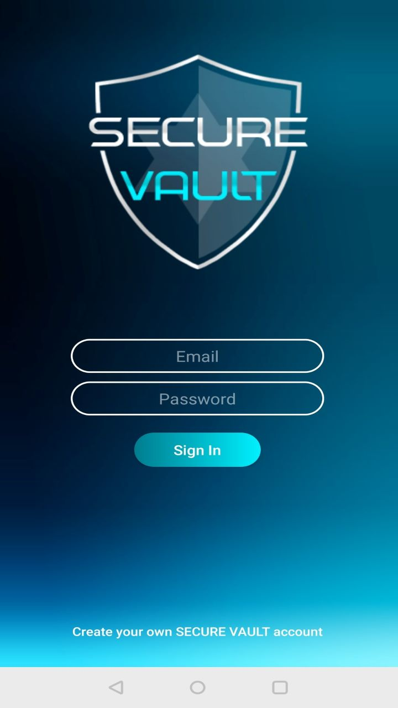
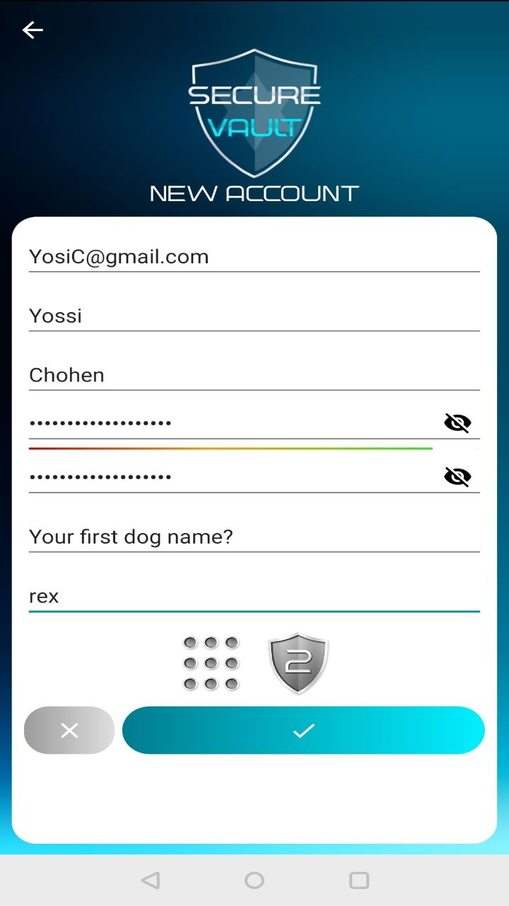
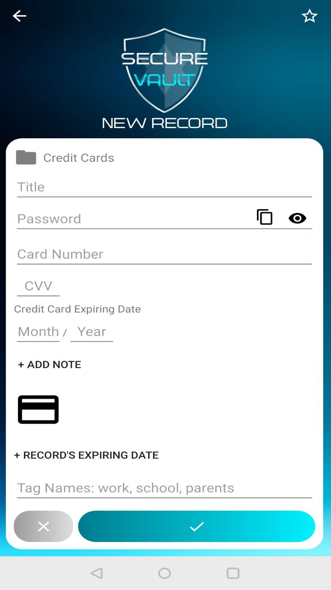
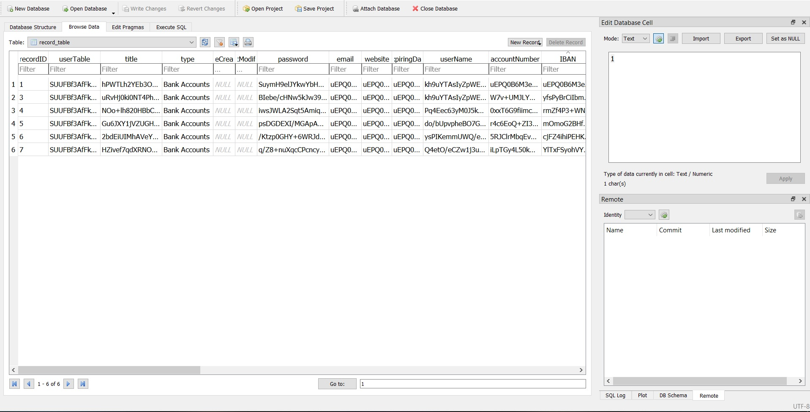

# Synopsis

Secure Vault is an android application that stores users passwords and information securely.

   
    

## Goals

Provide secure user password and information storage platform.

## Motivation

As technology grows so does user demand for privacy. 
Using multiple and different passwords helps us to keep our data safe, However,
the difficulty of remembering the passwords often keeps them unsecured on the device or alternatively on paper.
This is where we came in the picture with an android application that stores user's passwords and information securely on the device.

## Code Example

    public String encryptWithKey(String Key, String stringToEncrypt) throws Exception {
        SecretKeySpec key = generateKey(Key);
        Cipher c = Cipher.getInstance(getAES());
        c.init(Cipher.ENCRYPT_MODE, key);
        byte[] encVal = c.doFinal(stringToEncrypt.getBytes());
        String encryptedValue = Base64.encodeToString(encVal, Base64.DEFAULT);
        return encryptedValue;
    }

    public String encrypt(String stringToEncrypt) throws Exception {
        SecretKeySpec key = generateKey(stringToEncrypt);
        Cipher c = Cipher.getInstance(getAES());
        c.init(Cipher.ENCRYPT_MODE, key);
        byte[] encVal = c.doFinal(stringToEncrypt.getBytes());
        String encryptedValue = Base64.encodeToString(encVal, Base64.DEFAULT);
        return encryptedValue;
    }

    public String decrypt(String encryptedString, String Key) throws Exception {
        SecretKeySpec key = generateKey(Key);
        Cipher c = Cipher.getInstance(getAES());
        c.init(Cipher.DECRYPT_MODE, key);
        byte[] decodeValue = Base64.decode(encryptedString, Base64.DEFAULT);
        byte[] decValue = c.doFinal(decodeValue);
        String decryptedValue = new String(decValue);
        return decryptedValue;
    }

    public SecretKeySpec generateKey(String Key) throws Exception {
        final MessageDigest digest = MessageDigest.getInstance("SHA-256");
        byte[] bytes = Key.getBytes("UTF-8");
        digest.update(bytes, 0, bytes.length);
        byte[] key = digest.digest();
        SecretKeySpec secretKeySpec = new SecretKeySpec(key, "AES");
        return secretKeySpec;
    }

## Install

Download and install Android Studio.
Open Android Studio.
Click on File ----> New -----> Project from Version Control ----> Git.
On the website of the repository click on "clone or download" and copy the link.
On Android Studio on the "Clone Repository" window paste the link in the URL and create a new directory.
Click on Clone.

## Usage

- https://youtu.be/aiUE0lkhenY

## Tests
- https://youtu.be/lae-VeC_U14
- https://youtu.be/Wz_grlakhpc
- https://youtu.be/9rYXj7sjQHY
- https://youtu.be/TrWC3oHKn9A

## Contributors

- Yotam Shoval
- Evgeni Iseev
- Ori Even-Chen
- Idan Bardugo

For information on the app contact me on:
idanbar93@gmail.com

## License

© Idan Bardugo, Holon Institute of Technology
